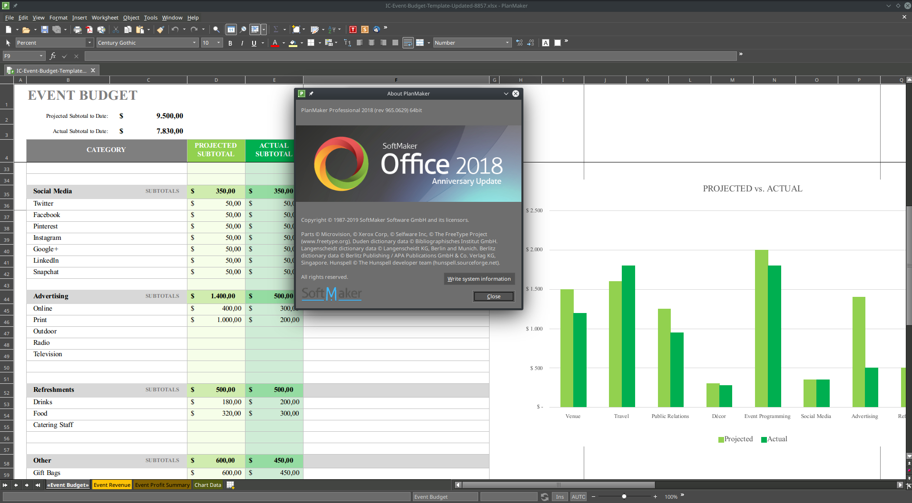
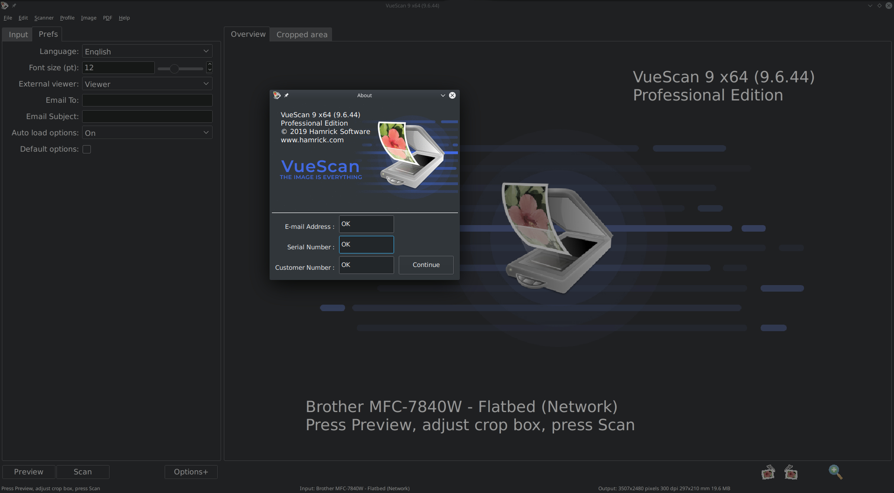
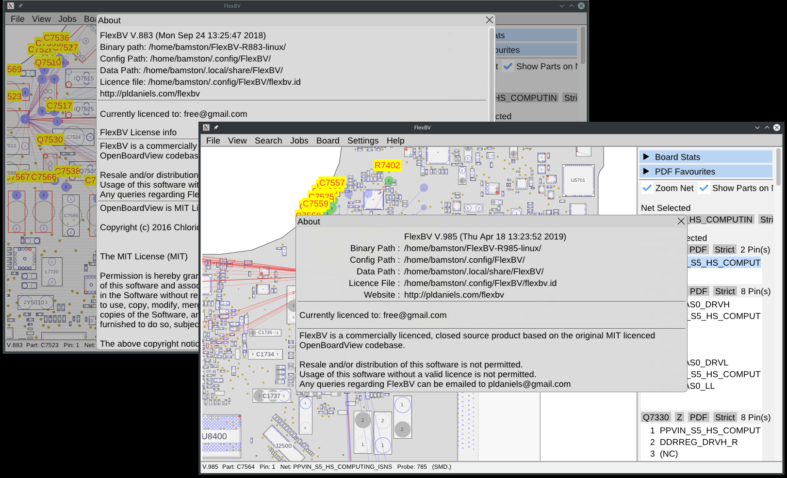

# [Script for patching SoftMaker Office 2018](https://cipherhater.pro/softmaker/)

	
<b>
		Only for revision 965.0629 and only for Linux x86_64
	</b>

#### SoftMaker Office license key required: NO

---

# [Script for patching Master PDF Editor 5.4.33](https://cipherhater.pro/mpdf/)

Master PDF Editor is the optimal solution for editing PDF files in Linux.

	
<b>
		Only for version 5.4.33 and only for Linux x86_64
	</b>

#### Master PDF Editor license key required: NO

---

# [Script for patching Autodesk EAGLE Version 9.4.2](https://cipherhater.pro/eagle/)

Autodesk EAGLE is an electronic design automation (EDA) software.

	
<b>
		Only for version 9.4.2 and only for Linux x86_64
	</b>

#### EAGLE Premium license key required: NO

---

# [Script for patching QCAD - 2D CAD Version 3.22.1](https://cipherhater.pro/qcad/)

QCAD is a application for computer aided drafting (CAD) in two dimensions (2D).

	
<b>
		Only for version 3.22.1 and only for Linux x86_64
	</b>

#### QCAD license key required: NO

---

# [Script for patching QCAD/CAM Version 3.22.1](https://cipherhater.pro/qcam/)

QCAD/CAM is QCAD Professional with a CAM (Computer-Aided Manufacturing) module.

	
<b>
		Only for version 3.22.1 and only for Linux x86_64
	</b>

#### QCAD/CAM license key required: NO

---

# [Script for patching Sublime Text 3, Sublime Merge](https://cipherhater.pro/sublime/)

	
<b>
		Only for builds 3207/3208 and 1107/1112/1116 and only for Linux x86_64
	</b>

#### Sublime Text/Merge license key required: YES (License key in patch, you can enter your name!)

---

# [License key and script for patching VueScan 9 x64](https://cipherhater.pro/vuescan/)

	
<b>
		Only for version v9.6.44 and only for Linux x86_64
	</b>

#### License key required: YES

---

# [Script for patching FlexBV x64](https://cipherhater.pro/flexbv/)

	
<b>
		Only for version R883/R985/R1007/R1020/R1024/R1060 and only for Linux x86_64
	</b>

#### License key required: NO

---

## [Discussion and thanks here](https://gist.github.com/cipherhater/4e75d4e4551db171de03e9618456a7ea)

    
<b>
	"We do not pay for programs that you do not know how to protect..." &copy; CipherHater
    </b>

    

	Copyright &copy; 2019 CipherHater All rights reserved.
    

