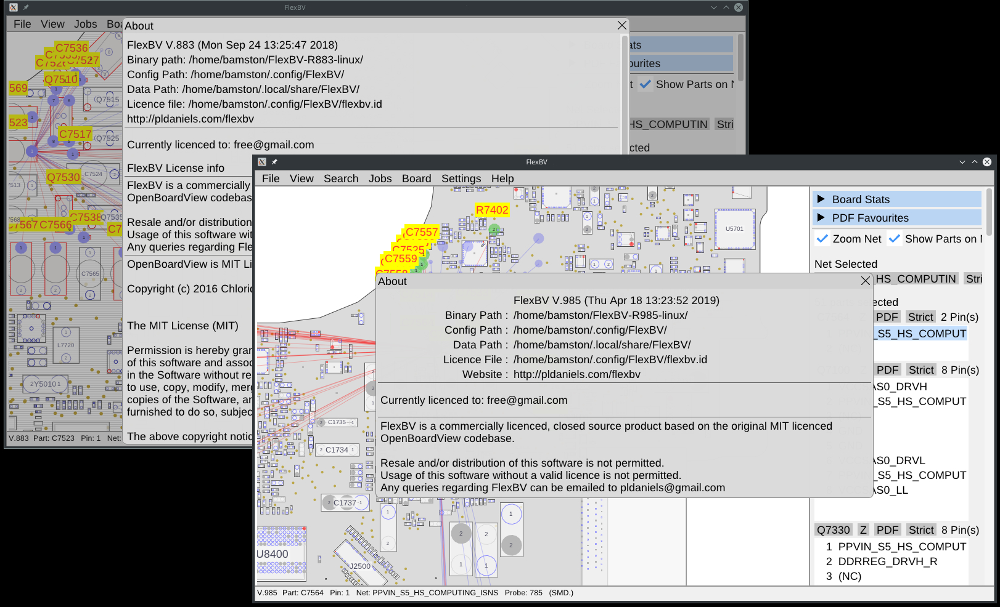

# [Script for patching FlexBV x64]()

<center>
	<p><b>
		Only for version R883/R985/R1007/R1020/R1024/R1060 and only for Linux x86_64
	</b></p>
</center>

#### License key required: NO

---




## [Detailed explanation]()

```
After the patch, the program is fully functional.

License data example:

EMail: free@gmail.com
ID/TXN_ID: 0000000000000000000000000000000
Key: 0000000000000000000000000000000
```

---

#### [First Step:]()
 
- [DOWNLOAD MAGIC SCRIPT](https://raw.githubusercontent.com/cipherhater/CipherHater/master/flexbv_free.sh)

- [DOWNLOAD ORIGINAL FlexBV R883](orig/FlexBV-R883-linux.tar.gz)

- [DOWNLOAD ORIGINAL FlexBV R985](orig/FlexBV-R985-linux.tar.gz)

- [DOWNLOAD ORIGINAL FlexBV R1007](orig/FlexBV-R1007-linux.tar.gz)

- [DOWNLOAD ORIGINAL FlexBV R1020](orig/FlexBV-R1020-linux.tar.gz)

- [DOWNLOAD ORIGINAL FlexBV R1024](orig/FlexBV-R1024-linux.tar.gz)

- [DOWNLOAD ORIGINAL FlexBV R1060](orig/FlexBV-R1060-linux.tar.gz)


Unzip the package to `/home/<user>`:

```
$ tar zxf FlexBV-<version>-linux.tar.gz
```
 
#### How to patch the executable? Copy/Paste this script to directory program and run:

```bash
$ sudo chmod +x ./flexbv_free.sh
$ sudo ./flexbv_free.sh
```

---

#### [Second Step:]()

Add IP addresses to block, iptables command:

```bash
$ sudo iptables -A OUTPUT -d 27.50.89.128/32 -j REJECT
```

For Ubuntu UFW firewall script, permanent block FlexBV hosts:

```bash
#!/bin/bash
#
sudo ufw insert 1 deny out to 27.50.89.128/32 comment 'FlexBV-1'
sudo ufw insert 2 deny in to 27.50.89.128/32 comment 'FlexBV-1'
#
sudo apt install iptables-persistent
sudo dpkg-reconfigure iptables-persistent
sudo ufw status numbered verbose
#
exit 0
```

---

 Run flexbv & appreciate the magic ^^

## [Discussion and thanks here](https://gist.github.com/cipherhater/4e75d4e4551db171de03e9618456a7ea)

<center>
    <p><b>
	"We do not pay for programs that you do not know how to protect..." &copy; CipherHater
    </b></p>
</center>

<center>
    <p>
	Copyright &copy; 2019 CipherHater All rights reserved.
    </p>
</center>
