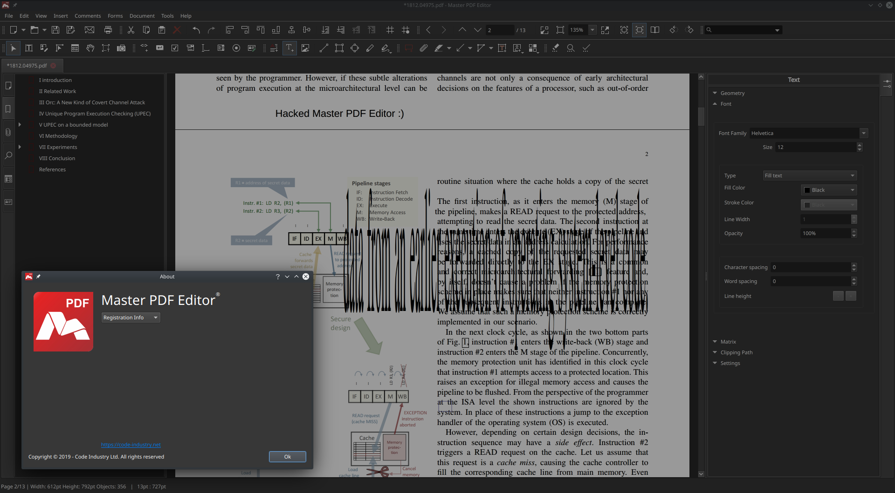

# [Script for patching Master PDF Editor 5.4.33](https://cipherhater.pro/mpdf/)

Master PDF Editor is the optimal solution for editing PDF files in Linux.

<center>
	<p><b>
		Only for version 5.4.33 and only for Linux x86_64
	</b></p>
</center>

#### Master PDF Editor license key required: NO

---




## [Detailed explanation]()


#### [First Step:]()


- [PAY 260$ FOR RECEIVING A MAGIC SCRIPT](https://en.cryptobadges.io/donate/13mzRviMxLg3HDojL7YJZajwtVLa124E8X)

- [Report a payment and an anonymous email address to get the script for patching](https://gist.github.com/cipherhater/4e75d4e4551db171de03e9618456a7ea)

- [DOWNLOAD ORIGINAL TARBALL](https://code-industry.net/free-pdf-editor/#get)


Install the package:

Copy and unpack tarball for work directory:

```bash
$ cd && mkdir mpdf
$ tar zxf master-pdf-editor-5.4.33-qt5-all.amd64.tar.gz
``` 

#### How to patch the executable? 


- Copy/Paste this script to `/home/<user>/<workdir>` and run script:

```bash
$ chmod +x ./mpdf_patch.sh
$ ./mpdf_patch.sh
```


 Run Master PDF Editor & appreciate the magic ^^
 
---

## [Discussion and thanks here](https://gist.github.com/cipherhater/4e75d4e4551db171de03e9618456a7ea)

<center>
    <p><b>
	"We do not pay for programs that you do not know how to protect..." &copy; CipherHater
    </b></p>
</center>

<center>
    <p>
	Copyright &copy; 2019 CipherHater All rights reserved.
    </p>
</center>
