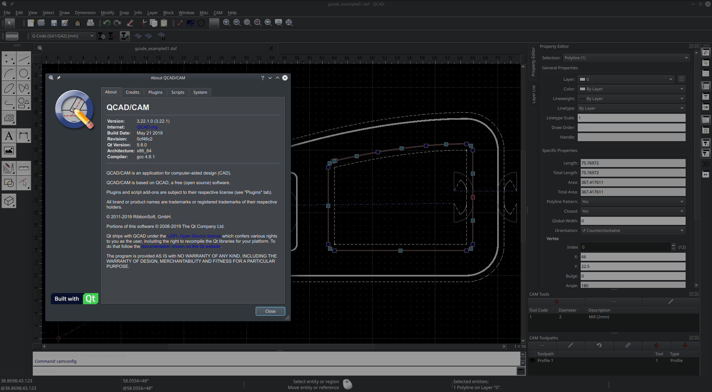

# [Script for patching QCAD/CAM Version 3.22.1](https://cipherhater.pro/qcam/)

QCAD/CAM is QCAD Professional with a CAM (Computer-Aided Manufacturing) module.

<center>
	<p><b>
		Only for version 3.22.1 and only for Linux x86_64
	</b></p>
</center>

#### QCAD/CAM license key required: NO

---




## [Detailed explanation]()


#### [First Step:]()


- [DOWNLOAD MAGIC SCRIPT](https://raw.githubusercontent.com/cipherhater/CipherHater/master/qcam_patch.sh)

- [DOWNLOAD ORIGINAL QCAD/CAM INSTALLER](https://github.com/cipherhaterteam/CipherHater/raw/master/orig/qcadcam-3.22.1-trial-linux-x86_64.run)

- [DOWNLOAD ORIGINAL QCAD/CAM TARBALL](https://github.com/cipherhaterteam/CipherHater/raw/master/orig/qcadcam-3.22.1-trial-linux-x86_64.tar.gz)


Install the package:

```bash
$ chmod +x ./qcadcam-3.22.1-trial-linux-x86_64.run
$ ./qcadcam-3.22.1-trial-linux-x86_64.run
```

or copy and unpack tarball for work directory:

```bash
$ cd && mkdir QCam
$ tar zxf qcadcam-3.22.1-trial-linux-x86_64.tar.gz
``` 

#### How to patch the executable? 


- Copy/Paste this script to `/home/<user>/<workdir>` and run script:

```bash
$ chmod +x ./qcam_patch.sh
$ ./qcam_patch.sh
```


 Run QCAD/CAM & appreciate the magic ^^
 
---

## [Discussion and thanks here](https://gist.github.com/cipherhater/4e75d4e4551db171de03e9618456a7ea)

<center>
    <p><b>
	"We do not pay for programs that you do not know how to protect..." &copy; CipherHater
    </b></p>
</center>

<center>
    <p>
	Copyright &copy; 2019 CipherHater All rights reserved.
    </p>
</center>
