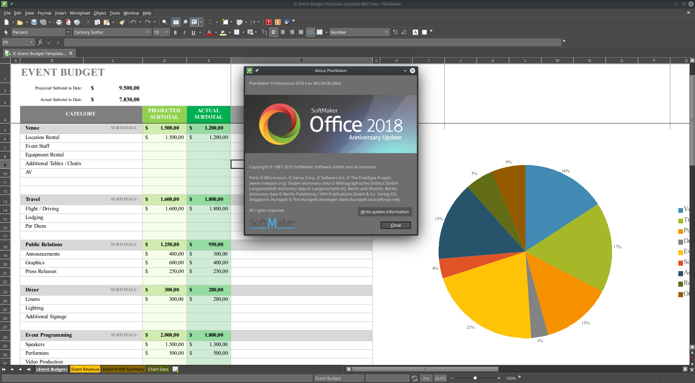

# [Script for patching SoftMaker Office 2018 x64]()

<center>
	<p><b>
		For version revision 962.0418 and only for Linux x86_64
	</b></p>
</center>

#### License key required: NO

---




## [Detailed explanation]()


#### [First Step:]()


- [DOWNLOAD MAGIC SCRIPT](https://raw.githubusercontent.com/cipherhater/CipherHater/master/softmaker_patch.sh)

- [DOWNLOAD ORIGINAL SOFTMAKER OFFICE 2018](https://www.softmaker.net/down/softmaker-office-2018_962-01_amd64.deb)

- [ALTERNATIVE DOWNLOAD ORIGINAL SOFTMAKER OFFICE 2018](https://github.com/cipherhaterteam/CipherHater/raw/master/orig/softmaker-office-2018_962-01_amd64.deb)


Install the package:

```bash
$ sudo gdebi ./softmaker-office-2018_962-01_amd64.deb
```

#### How to patch the executable? 

Before applying the patch, start TextMaker (or PlanMaker, Presentations) and click the "Trial Mode" button in the request form.
Trial mode will be deactivated after applying the patch.


- Copy/Paste this script to `/usr/share/office2018` and run script:

```bash
$ chmod +x ./softmaker_patch.sh
$ ./softmaker_patch.sh
```

---

#### [Second Step:]()

 - ```$ sudo nano /etc/hosts``` (you can use other text editor)

Entries ADD from /etc/hosts:

```
0.0.0.0 licensing.softmaker.com
0.0.0.0 jeju.softmaker.com
```
 
Click Enter to save file


 Run SoftMaker Office & appreciate the magic ^^
 
---

## [Discussion and thanks here](https://gist.github.com/cipherhater/4e75d4e4551db171de03e9618456a7ea)

<center>
    <p><b>
	"We do not pay for programs that you do not know how to protect..." &copy; CipherHater
    </b></p>
</center>

<center>
    <p>
	Copyright &copy; 2019 CipherHater All rights reserved.
    </p>
</center>
