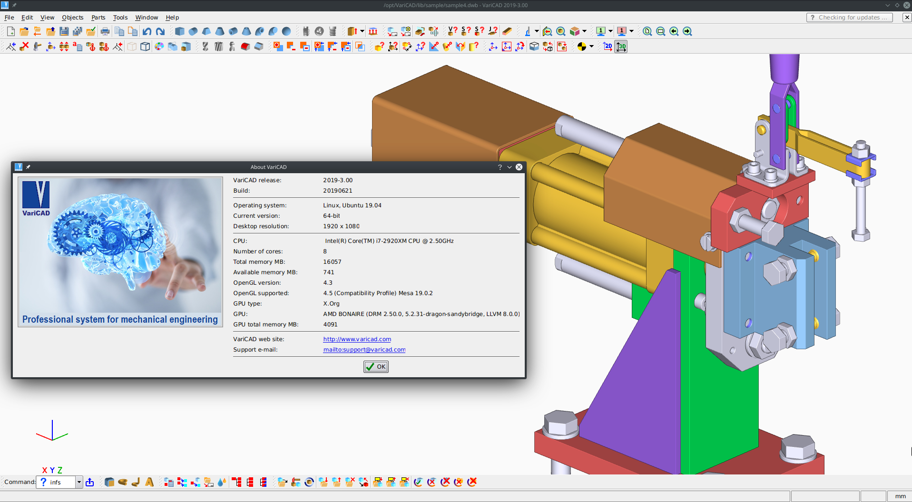

# [Script for patching VariCAD 2019-3.0 (20190621)]()

VariCAD - 3D / 2D CAD software for mechanical engineering.

<center>
	<p><b>
		Only for version 2019-3.0 Build 20190621 and only for Linux x86_64
	</b></p>
</center>

#### VariCAD license key required: NO

---




## [Detailed explanation]()


#### [First Step:]()


- [PAY 535$ FOR RECEIVING A MAGIC SCRIPT](https://en.cryptobadges.io/donate/13mzRviMxLg3HDojL7YJZajwtVLa124E8X)

- [Report a payment and an anonymous email address to get the script for patching](https://gist.github.com/cipherhater/4e75d4e4551db171de03e9618456a7ea)

- [DOWNLOAD ORIGINAL TARBALL](https://www.varicad.com/en/home/)


Install the package:

Copy and unpack tarball for work directory:

```bash
$ cd && mkdir VariCAD
$ tar zxf varicad2019-en_3.00_new-distr_amd64.deb
``` 

#### How to patch the executable? 


- Copy/Paste this script to `/home/<user>/<workdir>` and run script:

```bash
$ chmod +x ./varicad_patch.sh
$ ./varicad_patch.sh
```


 Run VariCAD 2019 & appreciate the magic ^^
 
---

## [Discussion and thanks here](https://gist.github.com/cipherhater/4e75d4e4551db171de03e9618456a7ea)

<center>
    <p><b>
	"We do not pay for programs that you do not know how to protect..." &copy; CipherHater
    </b></p>
</center>

<center>
    <p>
	Copyright &copy; 2019 CipherHater All rights reserved.
    </p>
</center>
