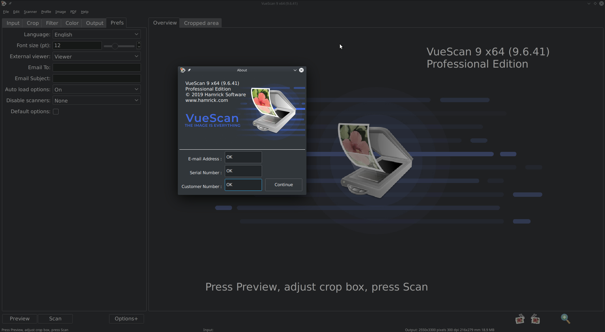

# [License key and script for patching VueScan 9 x64]()

<center>
	<p><b>
		For version v9.6.44 and only for Linux x86_64
	</b></p>
</center>

#### License key required: YES

---




## [Detailed explanation]()


**License key set for 9.6.44 Professional**


- [DOWNLOAD LICENSE KEY SET](orig/license.txt)

- If you have previously installed this program with a license,
  **remove the file** `/home/<user>/.vuescanrc`

---

#### [First Step:]()


- [DOWNLOAD MAGIC SCRIPT](https://raw.githubusercontent.com/cipherhater/CipherHater/master/vuescan_patch.sh)

- [DOWNLOAD ORIGINAL VUESCAN v9.6.44](orig/vuex6496_9644.tgz)

Unzip the package to `/home/<user>/VueScan`:

```
$ tar zxf vuex6496_9644.tgz
```

#### How to patch the executable? 

- Copy/Paste this script to `/home/<user>/VueScan` and run script:

```bash
$ chmod +x ./vuescan_patch.sh
$ ./vuescan_patch.sh
```

---

#### [Second Step:]()

 - ```$ sudo nano /etc/hosts``` (you can use other text editor)

Entries REMOVE from /etc/hosts:

```
 hamrick.com
 www.hamrick.com
 static.hamrick.com
 stats.hamrick.com
```
 
Click Enter to save file
 
**You can not add *hamrick* hosts to the hosts file!**

**The VueScan program parses /etc/host for the presence of their hosts in the file!**

---

#### [Third Step:]()

 Run VueScan & appreciate the magic ^^
 
 **Start VueScan command**

```bash
$ ~/VueScan/vuescan
```

- Paste License data in registration window

---

## [Discussion and thanks here](https://gist.github.com/cipherhater/4e75d4e4551db171de03e9618456a7ea)

<center>
    <p><b>
	"We do not pay for programs that you do not know how to protect..." &copy; CipherHater
    </b></p>
</center>

<center>
    <p>
	Copyright &copy; 2019 CipherHater All rights reserved.
    </p>
</center>
