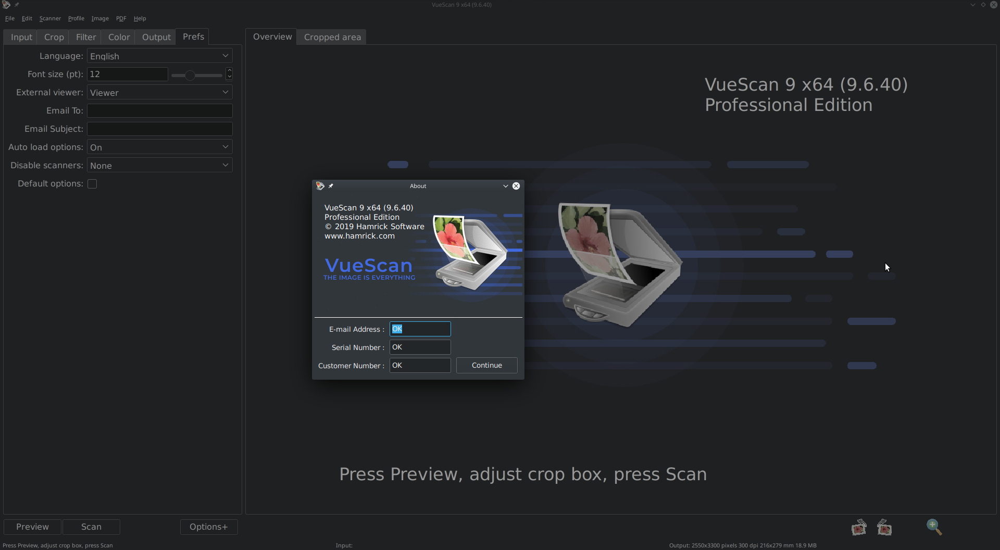

# [Valid license for VueScan 9 x64]()

<center>
	<p><b>
		For version v9.6.38/39/40 and only for Linux x86_64
	</b></p>
</center>

#### License key required: YES

---




## [Detailed explanation]()


**License key for 9.6.38/39/40 Professional**


- [DOWNLOAD LICENSE FILE 1](orig/license1/vuescanrc)

- [DOWNLOAD LICENSE FILE 2](orig/license2/vuescanrc)


- copy file ```vuescanrc``` to path ```/home/user```
and rename to name ```.vuescanrc```


---

#### [First Step:]()

- [DOWNLOAD ORIGINAL VUESCAN v9.6.38](orig/vuex6496_9638.tgz)

- [DOWNLOAD ORIGINAL VUESCAN v9.6.39](orig/vuex6496_9639.tgz)

- [DOWNLOAD ORIGINAL VUESCAN v9.6.40](orig/vuex6496_9640.tgz)

Unzip the package to `/home/<user>/VueScan`:

```
$ tar zxf vuex6496_<version>.tgz
```

- If you have previously installed this program with a license,
  **remove the file** `/home/<user>/.vuescanrc`

---

#### [Second Step:]()

 - ```$ sudo nano /etc/hosts``` (you can use other text editor)

Entries REMOVE from /etc/hosts:

```
 hamrick.com
 www.hamrick.com
 static.hamrick.com
 stats.hamrick.com
```
 
Click Enter to save file
 
**You can not add *hamrick* hosts to the hosts file!**

**The VueScan program parses /etc/host for the presence of their hosts in the file!**

---

#### [Third Step:]()
 
Add IP addresses to block, iptables command:

```bash
$ sudo iptables -A OUTPUT -d 104.131.17.148/32 -j REJECT
$ sudo iptables -A OUTPUT -d 162.243.24.127/32 -j REJECT
$ sudo iptables -A OUTPUT -d 52.84.197.57/32 -j REJECT
$ sudo iptables -A OUTPUT -d 52.84.197.136/32 -j REJECT
$ sudo iptables -A OUTPUT -d 52.84.197.89/32 -j REJECT
$ sudo iptables -A OUTPUT -d 52.84.197.132/32 -j REJECT
```

For Ubuntu UFW firewall script, permanent block all VueScan hosts:

```bash
#!/bin/bash
#
sudo ufw insert 1 deny out to 104.131.17.148/32 comment 'VUESCAN-1'
sudo ufw insert 2 deny in to 104.131.17.148/32 comment 'VUESCAN-1'
#
sudo ufw insert 3 deny out to 162.243.24.127/32 comment 'VUESCAN-2'
sudo ufw insert 4 deny in to 162.243.24.127/32 comment 'VUESCAN-2'
#
sudo ufw insert 5 deny out to 52.84.197.57/32 comment 'VUESCAN-3'
sudo ufw insert 6 deny in to 52.84.197.57/32 comment 'VUESCAN-3'
#
sudo ufw insert 7 deny out to 52.84.197.136/32 comment 'VUESCAN-4'
sudo ufw insert 8 deny in to 52.84.197.136/32 comment 'VUESCAN-4'
#
sudo ufw insert 9 deny out to 52.84.197.89/32 comment 'VUESCAN-5'
sudo ufw insert 10 deny in to 52.84.197.89/32 comment 'VUESCAN-5'
#
sudo ufw insert 11 deny out to 52.84.197.132/32 comment 'VUESCAN-6'
sudo ufw insert 12 deny in to 52.84.197.132/32 comment 'VUESCAN-6'
#
sudo apt install iptables-persistent
sudo dpkg-reconfigure iptables-persistent
sudo ufw status numbered verbose
#
exit 0
```

---

 Run VueScan & appreciate the magic ^^

## [Discussion and thanks here](https://gist.github.com/cipherhater/4e75d4e4551db171de03e9618456a7ea)

<center>
    <p><b>
	"We do not pay for programs that you do not know how to protect..." &copy; CipherHater
    </b></p>
</center>

<center>
    <p>
	Copyright &copy; 2019 CipherHater All rights reserved.
    </p>
</center>
